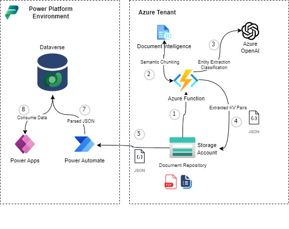

# Study Document Ingestion, Metadata Extraction, eArchive Request Automation

This project provides an example solution to illustrate the use of Azure AI Document Intelligence and Azure OpenAI to extract pertinent details and classifications from study documents for eArchive purposes. The intent is to replace a manual form which a user must fill out about a document when requesting the document to be eArchived in downstream systems, with an automated process triggered by the upload of said document. 

## Architecture

This solution includes a Durable Azure Function with Azure Blob Storage bindings for both trigger and output, the use of Azure AI Document Intelligence for initial document processing, and Azure OpenAI for more complex entity and classification extraction from section chunks. The result is a flattened JSON document of key/value pairs that is parsed and sent to Dataverse to record the eArchive request with details that would have been captured in a form from the user.

## AI Orchestration using Function App and Semantic Kernel

This solution includes a blob triggered durable function deployed to an Azure Function App, developed on Python with Semantic Kernel SDK to define and orchestrate prompt function calls to Azure OpenAI, as well as other libraries to perform calls to Azure AI Document Intelligence services.

1. Document uploaded to blob storage, triggers Azure Durable Function
  
Python function uses Langchain and AI Services Document Intelligence to:
2. Convert document to markdown
3. Split into chunks by heading
4. Detect Language
5. Identify presence of handwritten text (signature)
  
6. Python function uses Semantic Kernel to orchestrate semantic (prompt) functions to Azure OpenAI chat completion service to:
    * Classify document type from document chunks
    * Extract entities and metadata of interest from document chunks
  
7. Python function uses Typing and List libraries to
synthesize mode of entities extracted from chunks to return most likely correct value for various entities/metadata and forms into flattened JSON
  
9. Resulting JSON file is stored in blob storage for downstream processing

Reference Documentation:

* [Semantic Kernel GitHub Repo](https://github.com/microsoft/semantic-kernel/tree/main)
* [Getting Started with Semantic Kernel (Python)](https://github.com/microsoft/semantic-kernel/blob/main/python/README.md)
* [Understanding the Kernel in Semantic Kernel](https://learn.microsoft.com/en-us/semantic-kernel/agents/kernel/?tabs=python)
* [Adding AI Services to the Kernel](https://learn.microsoft.com/en-us/semantic-kernel/agents/kernel/adding-services?tabs=python)

## Power Platform Components
See [Power Platform Section](./powerplat/readme.md) for details

# Deployment Instructions

1. Create an Azure Function App in your Azure Subscription
2. Create a Storage Account in your Azure Subscription
3. Configure the Azure Function App with necessary application settings, such as connection strings for Azure Blob Storage. See local.settings.example.json for required settings
4. Deploy the function code to the Azure Function App
5. Follow instructions in [Power Platform section](/powerplat/readme.md) to deploy Power Platform portion of the solution

**Reference Documentation:**

* [Manage your function app](https://learn.microsoft.com/en-us/azure/azure-functions/functions-how-to-use-azure-function-app-settings?tabs=portal)
* [App Configuration references](https://learn.microsoft.com/en-us/azure/app-service/app-service-configuration-references?toc=%2Fazure%2Fazure-functions%2Ftoc.json)
* [Develop Azure Functions by using Visual Studio Code](https://learn.microsoft.com/en-us/azure/azure-functions/functions-develop-vs-code?tabs=node-v4%2Cpython-v2%2Cisolated-process&pivots=programming-language-python)

# Contributing

This project welcomes contributions and suggestions.  Most contributions require you to agree to a
Contributor License Agreement (CLA) declaring that you have the right to, and actually do, grant us
the rights to use your contribution. For details, visit https://cla.opensource.microsoft.com.

When you submit a pull request, a CLA bot will automatically determine whether you need to provide
a CLA and decorate the PR appropriately (e.g., status check, comment). Simply follow the instructions
provided by the bot. You will only need to do this once across all repos using our CLA.

This project has adopted the [Microsoft Open Source Code of Conduct](https://opensource.microsoft.com/codeofconduct/).
For more information see the [Code of Conduct FAQ](https://opensource.microsoft.com/codeofconduct/faq/) or
contact [opencode@microsoft.com](mailto:opencode@microsoft.com) with any additional questions or comments.

## Trademarks

This project may contain trademarks or logos for projects, products, or services. Authorized use of Microsoft 
trademarks or logos is subject to and must follow 
[Microsoft's Trademark & Brand Guidelines](https://www.microsoft.com/en-us/legal/intellectualproperty/trademarks/usage/general).
Use of Microsoft trademarks or logos in modified versions of this project must not cause confusion or imply Microsoft sponsorship.
Any use of third-party trademarks or logos are subject to those third-party's policies.
